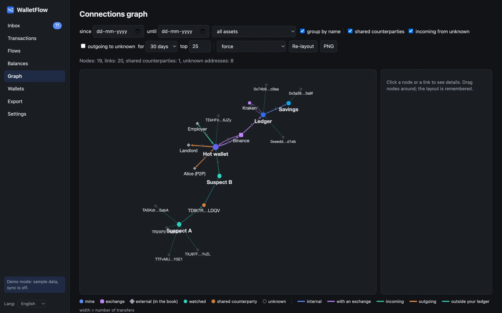
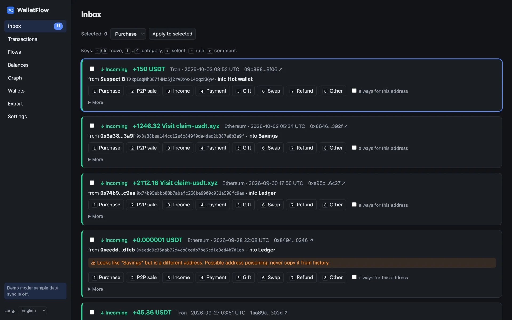
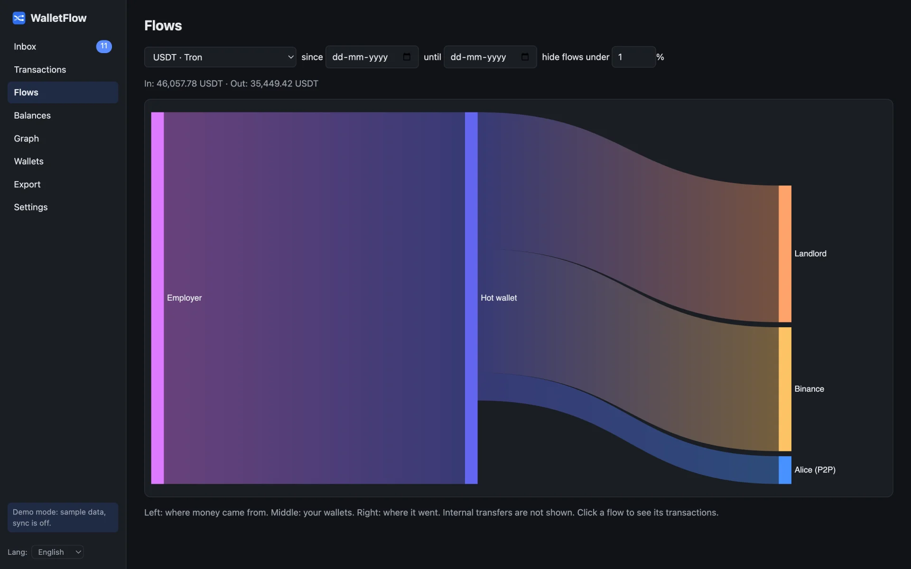
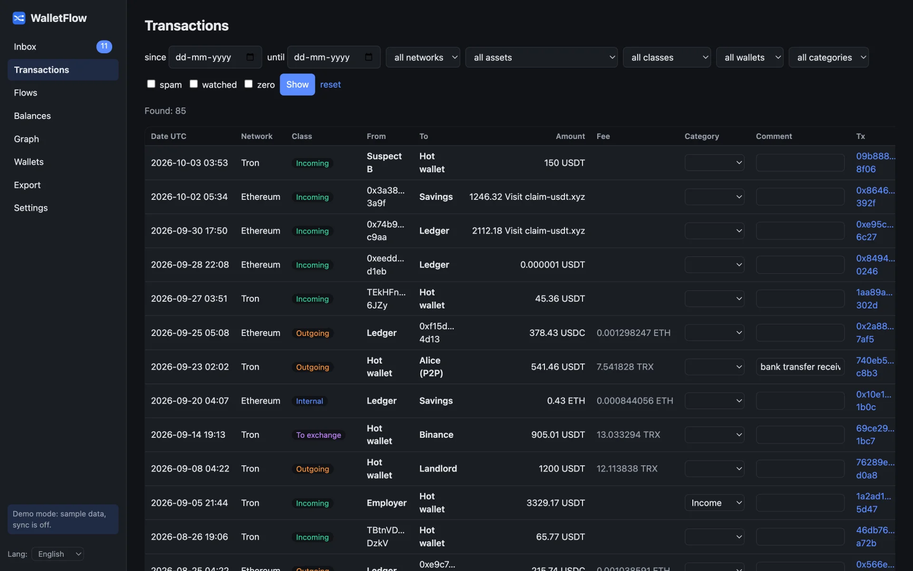
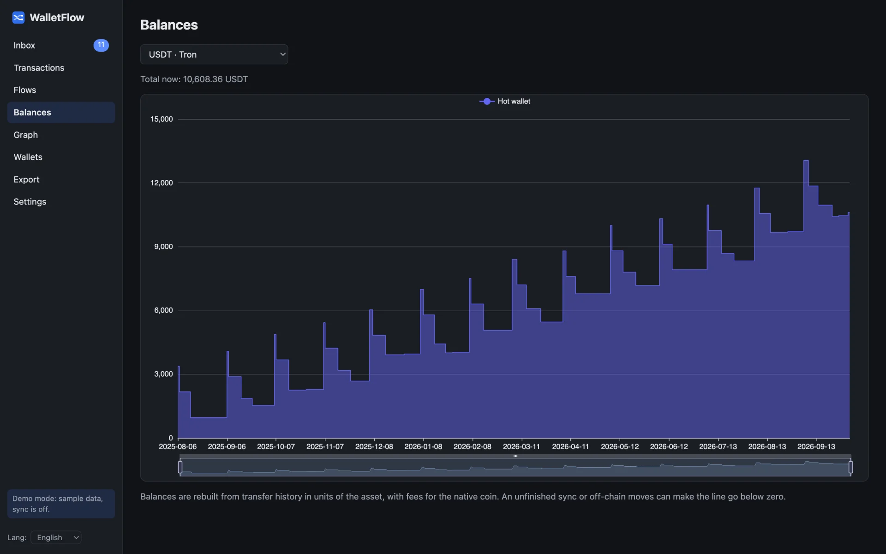

<p align="center">
  
</p>

<h1 align="center">WalletFlow</h1>

<p align="center">
  <b>A local, private ledger for your crypto wallets.</b><br>
  Paste your addresses, and WalletFlow pulls the history, spots transfers between your own wallets
  and exchanges by itself, and leaves only the rest for you to review.
</p>

<p align="center">
  <a href="https://github.com/dionisvl/walletflow/actions/workflows/ci.yml"></a>
  <a href="go.mod"></a>
  <a href="LICENSE"></a>
  <a href="README.ru.md"></a>
</p>

<p align="center">
  
</p>

## Why

Forensics tools draw beautiful graphs but live in the cloud and have no ledger.
Tax tools have a ledger but no graph, and you hand them your whole wallet map.
WalletFlow sits in between and keeps everything on your machine:

- **Local first.** One binary, one SQLite file. No account, no telemetry. Only public addresses: never seed phrases or keys.
- **Knows what is yours.** Mark addresses as *mine*, *exchange*, *external* or *watched*. Moves between your wallets and to/from exchanges are classified automatically.
- **Inbox zero.** Everything with outside addresses lands in an Inbox you clear with the keyboard (`1`…`9`, `j`/`k`). One tick turns a choice into a rule for the whole history.
- **See the money move.** A Sankey of where funds came from and went, balances over time, and an interactive connections graph.
- **Check how wallets are linked.** Add 2–10 wallets as *watched* and the graph shows direct transfers and **shared counterparties**, even when the wallets never paid each other.
- **Export.** The full journal to Excel or CSV, with names, fees and links.

## Try it in 10 seconds

No API keys needed for the demo: it runs on made-up wallets and fourteen months of sample transfers.

```bash
go run github.com/dionisvl/walletflow/cmd/walletflow@latest -demo
```

Or download a binary for macOS, Linux or Windows from [Releases](https://github.com/dionisvl/walletflow/releases) and run `walletflow -demo`.
The binaries are not signed: on macOS run `xattr -d com.apple.quarantine walletflow` once.

## Use it with your wallets

```bash
git clone https://github.com/dionisvl/walletflow && cd walletflow
cp .env.example .env      # add a free Etherscan key; TronGrid is optional
go run ./cmd/walletflow   # opens http://127.0.0.1:8080
```

1. **Wallets**: add your addresses with a name and a kind, or paste a list.
2. **Sync**: downloads the history (several addresses at once, rate-limited, resumable).
3. **Inbox**: review incoming and outgoing transfers with outside addresses.
4. **Flows, Balances, Graph, Export**: look at the result.

Settings live in [`.env.example`](.env.example). The database sits in your user config folder
(`~/Library/Application Support/WalletFlow` on macOS); `-db` points elsewhere.

## Screenshots

**Inbox**: review transfers with outside addresses from the keyboard.



**Flows**: where the money came from and where it went.



**Transactions**: the full journal with filters.



**Balances**: every wallet over time.



## Address kinds

| Kind | History downloaded | What it does |
|---|---|---|
| **Mine** | yes | Your ledger: Inbox, balances, flows, export. Mine ↔ mine is an internal transfer. |
| **Exchange** | no | Mine ↔ exchange is recognized as a deposit or withdrawal and skips the Inbox. |
| **External** | no | Just a name for a counterparty. Its transfers stay in the Inbox; add a rule to auto-categorize. |
| **Watched** | yes | Someone else's wallet, synced for the graph only and kept out of your ledger. |
| *not in the book* | no | Like *external*, without a name. |

Addresses with the same name are one entity (all your Binance deposit addresses become one node).
Exchange wallets have hundreds of thousands of transfers that a personal ledger does not need: before the
first sync WalletFlow measures an address's activity and skips it if it looks like an exchange or a service.

## Networks

| Network | Source | Notes |
|---|---|---|
| Ethereum, Arbitrum, Polygon, Linea | [Etherscan API V2](https://docs.etherscan.io) | one free key for all |
| Base, Optimism, BNB Chain | Etherscan API V2 | need a paid plan; hide them with `IGNORE_CHAINS` |
| Tron (TRX, TRC20) | [TronGrid](https://developers.tron.network) | key optional |

Bitcoin (xpub), Solana and USD prices are on the [roadmap](#roadmap).

## Privacy and security

- Runs on `127.0.0.1` and rejects requests from other sites (Host and Origin checks).
- Talks only to the block explorers above, with your public addresses. Nothing else leaves your machine.
- Address poisoning warning: lookalikes of your addresses are flagged in the Inbox.
- It never asks for seed phrases or private keys and has no way to move funds.

## How it works

Go standard library HTTP server with htmx pages, ECharts and Cytoscape.js embedded into the binary, SQLite via
[modernc.org/sqlite](https://gitlab.com/cznic/sqlite) (no CGO). Amounts are integers in minimal units, never floats.

```
cmd/walletflow        entry point
internal/chain/...    Etherscan and TronGrid clients
internal/store        SQLite, migrations, queries
internal/ledger       domain model and the classifier
internal/syncer       background sync
internal/report       data for the Sankey, balances and the graph
internal/web          handlers, templates, static files
internal/i18n         English and Russian UI
```

## Roadmap

- [ ] Historical USD prices and a dashboard
- [ ] Bitcoin with xpub (change addresses count as your own)
- [ ] Exchange CSV import matched by transaction hash
- [ ] Solana
- [ ] Swap decoding and a tax report (FIFO)

Ideas and pull requests are welcome: see [CONTRIBUTING.md](CONTRIBUTING.md).

## License

[MIT](LICENSE). Bundled libraries keep their own licenses: see [THIRD_PARTY.md](THIRD_PARTY.md).
